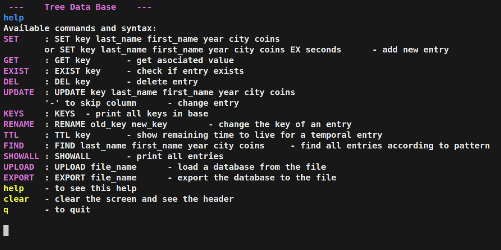
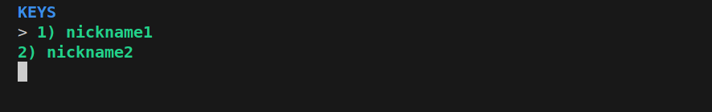
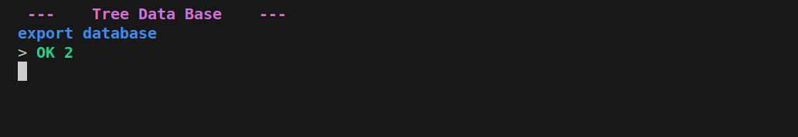
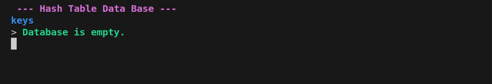
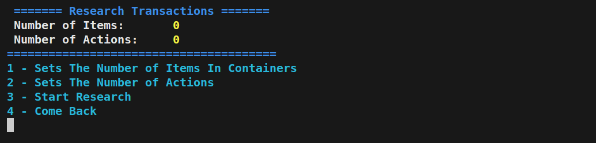
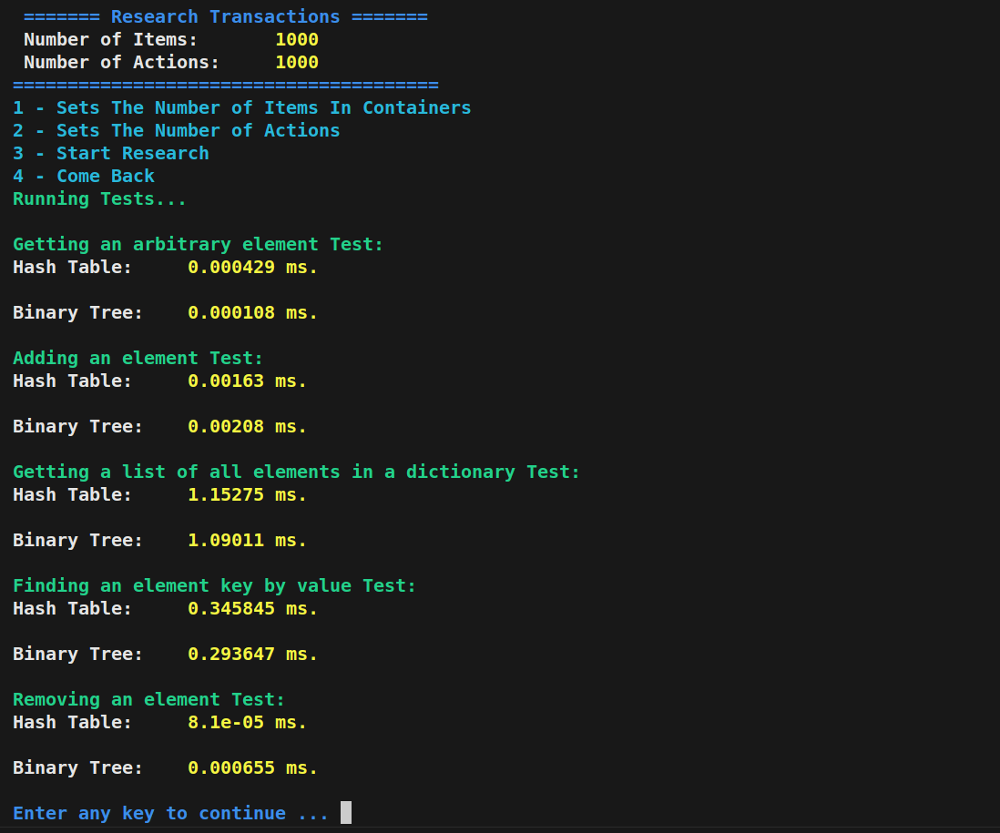

## Консольная База Данных на С++

#### Для сборки перейдите в source_code/ и используйте команду:

`make build`

#### После успешной сборки, исполняемый файл будет лежать в директории build. Для запуска программы введите команду:

`./build/transactions`

#### У программы есть консольный интерфейс, и главное окно программы имеет вид

#### Как и у любого консольного интерфейса, программа будет бесконечно ожидать ввод со стороны пользователя. Здесь у вас есть четыре функциональных клавиши:

- `1` (Создаст Базу Данных на основе хэш-таблицы).
- `2` (Создаст Базу Данных на основе самобалансированного дерева AVL).
- `3` (Режим исследование на какой структуре данных База будет работать быстрее).
- `4` (Выход из программы, также чтобы выйти можете нажать `CTRL+C` или `CTRL+D`).
- Выберите нужный для вас вариант и нажмите `Enter`.

#### При выборе `1` вас встретить консольный интерфейс, в котором вы уже смело можете вводить команды:

#### При выборе `2`:

#### Здесь сразу можете написать что угодно и нажать `Enter`, программа предложит вам написать `help`:

#### Используя команду `help` вы получите полный список всех команд БД и их краткое описание:

#### База Данных является харнилищем данных типа <Key, Value>. Key представляет из себя уникальный `nickname` студента и является строкой. Value - это класс `StudentRecord`, полное его описание, находится в файле `source_code/student_record.hpp`.

#### Что из себя представляет этот класс:

- last_name - фамилия студента `(тип данных: строка)`
- first_name - имя студента `(тип данных: строка)`
- year_of_birth - год рождения студента `(тип данных: целое число)`
- city - город студента `(тип данных: строка)`
- coins - количество монет у студента, виртуальная валюта `(тип данных: целое число)`

#### Давайте добавим пару записей в нашу базу, используя команду Set. Программа регистронезависимая, поэтому ключевые слова команд не обязательно писать заглавными буквами.

#### Далее с помощью команды `KEYS`  выведем уникальные никнеймы, хранящиеся в БД:

#### Для того чтобы получить `Value` по ключу, используем команду `GET`:

#### Для того чтобы обновить значение по ключу, используем команду `UPDATE` и `GET`, чтобы проверить вступили ли изменения в силу, чтобы пропустить значение поле, которое менять не нужно, используется знак `-`:

#### Так как ключи уникальные, то при попытке вставить новую запись командой `SET` с уже существующим ключом приведет к ошибке:

#### Использовав команду `CLEAR` можно очистить истории предидущих команд, а команда `q` позволит выйти из меню, выбранной базы данных, если это сделать, то агрегированные данные исчезнут. Для сохранения данных есть удобная команда `EXPORT`:

#### Теперь сменим хранилище и проверим есть ли в нем данные, с помощью команды `KEYS`:

#### Загрузим сохраненные ранее данные с помощью команды `UPLOAD` и проверим содержание БД:

#### А теперь посмотрим занчения этих ключей с помощью удобной комнды `SHOWALL`

#### Основные команды были рассмотрены теперь можем выйти из меню БД и перейти в меню исследования. В нем вас будет ждать такой функционал:

- `1` Выбрать количество элементов для первого хранилища (Значения этих элементов сгенерируются рандомно в программном коде).
- `2` Выбрать количество элементов для второго хранилища (Значения также сгенерируются рандомно).
- `3` Запустить исследование (в нем будут запущены ряд тестов и результаты работы с наименованием теста и затраченным временем буду напечартаны в консоли)
- `4` Выйти назад в меню

#### Пример исследования с 1000 элементов в каждой кллекции.

