## Console Database in C++

#### To build, go to source_code/ and use the command:

`make build`

#### After successful assembly, the executable file will be located in the build directory. To run the program, enter the command:

`./build/transactions`

#### The program has a console interface, and the main program window looks like

#### Like any console interface, the program will wait indefinitely for input from the user. Here you have four function keys:

- `1` (Creates a Database based on a hash table).
- `2` (Creates a Database based on a self-balanced AVL tree).
- `3` (Research mode on which data structure the database will work faster).
- `4` (Exit the program, you can also press `CTRL+C` or `CTRL+D` to exit).
- Select the option you need and click `Enter`.

#### When you select `1` you will be greeted with a console interface in which you can safely enter commands:

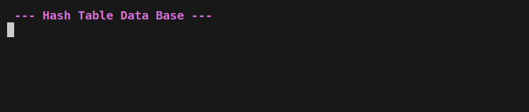

#### When selecting `2`:

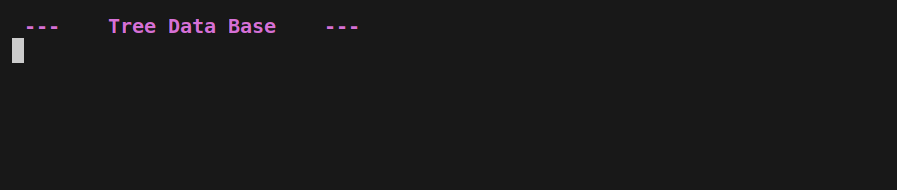

#### Here you can immediately write anything and press `Enter`, the program will prompt you to write `help`:

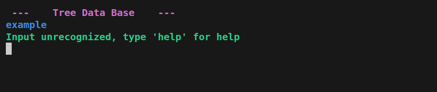

#### Using the `help` command you will get a complete list of all database commands and their brief description:

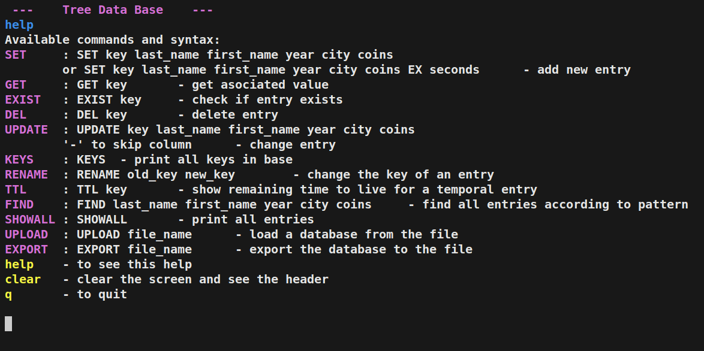

#### The Database is a repository of data of type <Key, Value>. Key represents the student's unique `nickname` and is a string. Value is the `StudentRecord` class, its full description is in the `source_code/student_record.hpp` file.

#### What is this class:

- last_name - last name of the student `(data type: string)`
- first_name - student name `(data type: string)`
- year_of_birth - year of birth of the student `(data type: integer)`
- city - student's city `(data type: string)`
- coins - the number of coins the student has, virtual currency `(data type: integer)`

#### Let's add a couple of records to our database using the Set command. The program is case-insensitive, so command keywords do not have to be written in capital letters.

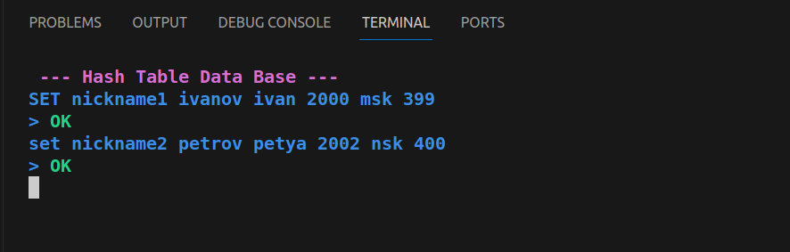

#### Next, using the `KEYS` command, we will display the unique nicknames stored in the database:

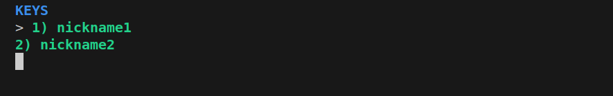

#### In order to get `Value` by key, use the `GET` command:

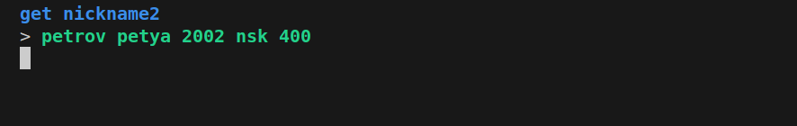

#### In order to update the value by key, we use the `UPDATE` command and `GET` to check whether the changes have taken effect, to skip the value of a field that does not need to be changed, use the `-` sign:

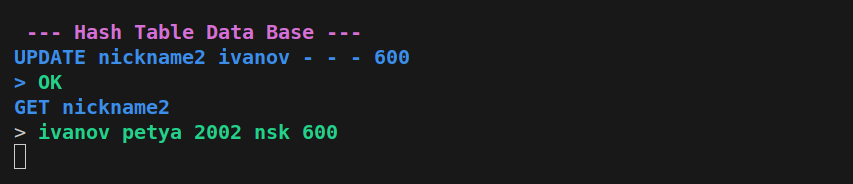

#### Since the keys are unique, trying to insert a new record with the `SET` command with an existing key will result in an error:

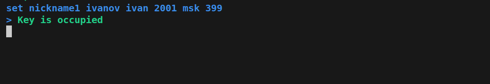

#### Using the `CLEAR` command you can clear the history of previous commands, and the `q` command will allow you to exit the menu of the selected database; if you do this, the aggregated data will disappear. To save data there is a convenient command `EXPORT`:

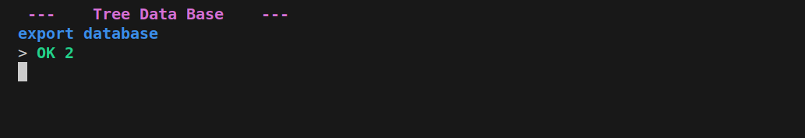

#### Now let's change the storage and check if there is data in it using the `KEYS` command:

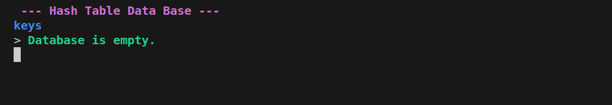

#### Let's load the previously saved data using the `UPLOAD` command and check the contents of the database:

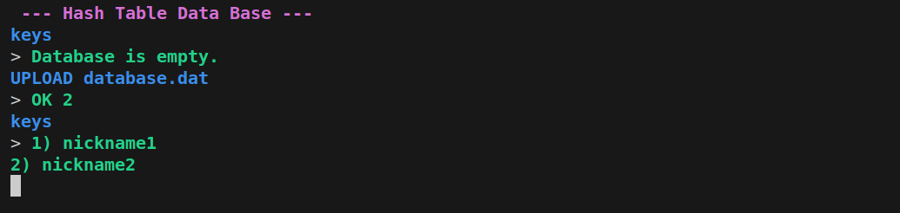

#### Now let's see the meaning of these keys using the convenient `SHOWALL` command

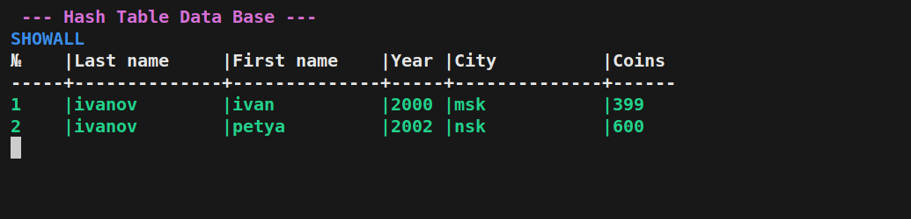

#### The basic commands have been covered, now we can exit the database menu and go to the research menu. It will provide you with the following functionality:

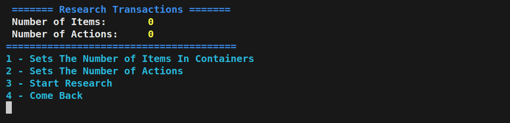

- `1` Select the number of elements for the first storage (The values ​​of these elements are generated randomly in the program code).
- `2` Select the number of elements for the second storage (Values ​​will also be generated randomly).
- `3` Run the study (a number of tests will be launched in it and the results of the work with the name of the test and the time spent will be printed in the console)
- `4` Exit back to menu

#### Example of a study with 1000 elements in each collection.

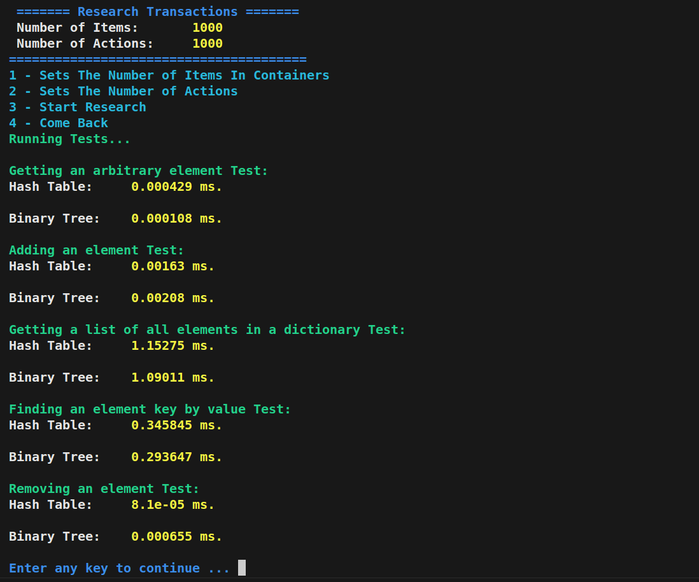